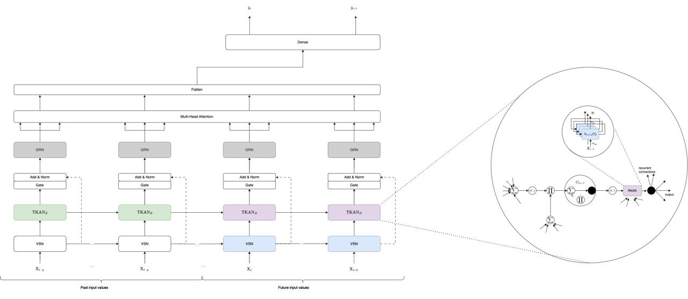

# Temporal Kolmogorov-Arnold Transformer for Time Series Forecasting



This folder includes the original code implemented for the [paper](https://arxiv.org/abs/2406.02486) of the same name. The model is made in keras3 and is supporting all backend (jax, tensorflow, pytorch).

It is inspired on the Temporal Fusion Transformer by [google-research](https://github.com/google-research/google-research/tree/master/tft) and the [Temporal Kolmogorov Arnold Network](https://github.com/remigenet/TKAN). 

The Temporal Kolmogorov-Arnold Transformer uses the TKAN layers from the [paper](https://arxiv.org/abs/2405.07344) to improve the performance of the Temporal Fusion Transformer by replacing the internal LSTM encoder and decoder part. It needs the implementation available here [tkan](https://github.com/remigenet/tkan) with version >= 0.2.

The TKAT is however different from the Temporal Fusion Transformer on many aspects like the absence of static inputs and a different architecture after the multihead.

## Installation

A Pypi package is available for the TKAT implementation. You can install it directly from PyPI:

```bash
pip install tkat
```

or can be installed by cloning the repo and using:

```bash
pip install path/to/tkat
```

## Usage

Contrary to the TKAN package, the TKAT is a full model implementation and thus can be used directly as a model. Here is an example of how to use it:

```python
from tkat import TKAT

N_MAX_EPOCHS = 100
BATCH_SIZE = 128
early_stopping_callback = lambda : tf.keras.callbacks.EarlyStopping(
    monitor="val_loss",
    min_delta=0.00001,
    patience=6,
    mode="min",
    restore_best_weights=True,
    start_from_epoch=6,
)
lr_callback = lambda : tf.keras.callbacks.ReduceLROnPlateau(
    monitor="val_loss",
    factor=0.25,
    patience=3,
    mode="min",
    min_delta=0.00001,
    min_lr=0.000025,
    verbose=0,
)
callbacks = lambda : [early_stopping_callback(), lr_callback(), tf.keras.callbacks.TerminateOnNaN()]


sequence_length = 30
num_unknow_features = 8
num_know_features = 2
num_embedding = 1
num_hidden = 100
num_heads = 4
use_tkan = True

model = TKAT(sequence_length, num_unknow_features, num_know_features, num_embedding, num_hidden, num_heads, n_ahead, use_tkan = use_tkan)
optimizer = tf.keras.optimizers.Adam(0.001)
model.compile(optimizer=optimizer, loss='mean_squared_error')

model.summary()

history = model.fit(X_train, y_train, batch_size=BATCH_SIZE, epochs=N_MAX_EPOCHS, validation_split=0.2, callbacks=callbacks(), shuffle=True, verbose = False)

test_preds = model.predict(X_test)

```

X_train should be a numpy array of shape (n_samples, sequence_length + n_ahead, num_unknow_features + num_know_features) and y_train should be a numpy array of shape (n_samples, n_ahead).
The values in X_train[:,sequence_length:,:num_unknow_features] are not used and can be set to 0.
The known inputs should be the last features in X_train.

For a more detailed example please look to the notebook in the example folder.


Shield: [![CC BY-NC-SA 4.0][cc-by-nc-sa-shield]][cc-by-nc-sa]

This work is licensed under a
[Creative Commons Attribution-NonCommercial-ShareAlike 4.0 International License][cc-by-nc-sa].

[![CC BY-NC-SA 4.0][cc-by-nc-sa-image]][cc-by-nc-sa]

[cc-by-nc-sa]: http://creativecommons.org/licenses/by-nc-sa/4.0/
[cc-by-nc-sa-image]: https://licensebuttons.net/l/by-nc-sa/4.0/88x31.png
[cc-by-nc-sa-shield]: https://img.shields.io/badge/License-CC%20BY--NC--SA%204.0-lightgrey.svg
